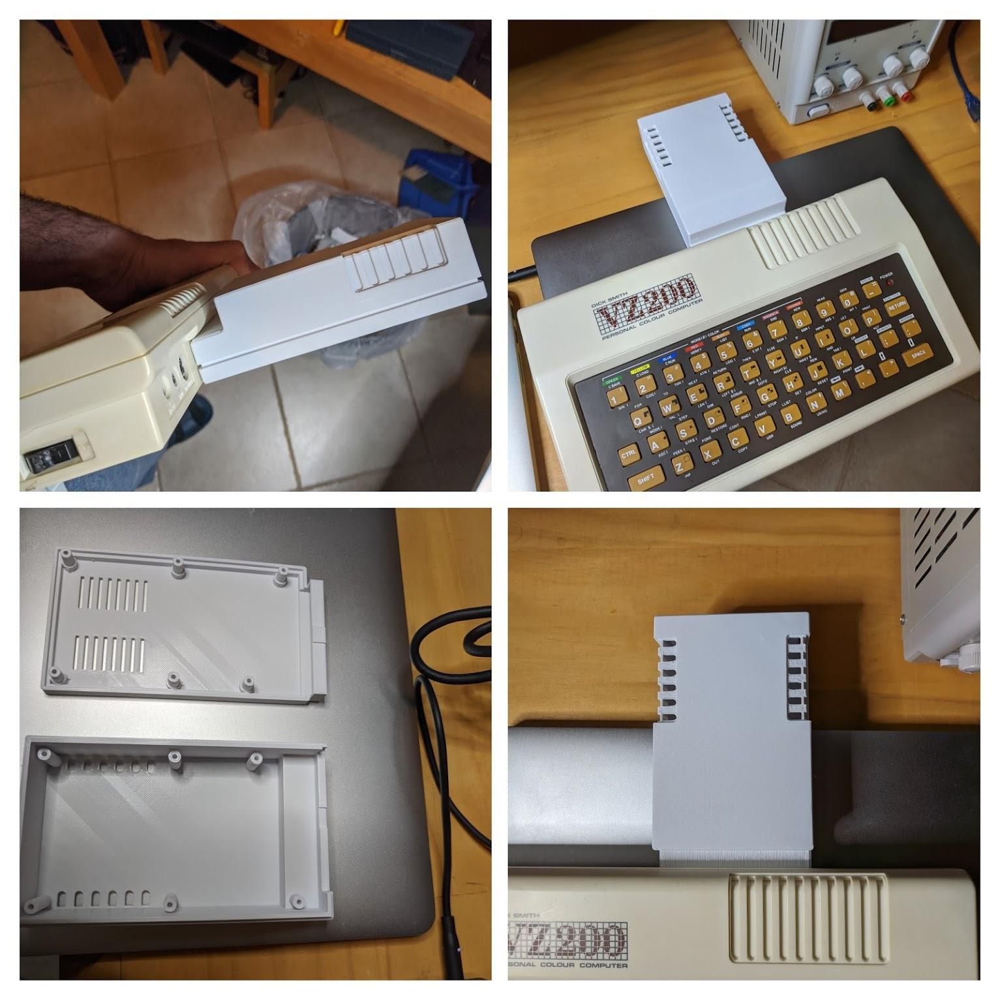

# What is this?

A FreeCAD Expansion case for the VZ200.

The original dimension have been used as best able to determine so that this case is suitable for recreating existing available hardware. The 3D model has been printed and fits the VZ200 expansion port OK.

Looking at the measurements, an 44x2 pin edge connector (last seen here https://www.ebay.com.au/itm/5pc-Industrial-Card-Edge-Slot-Socket-Connector-22x2P-44P-2-54mm-0-1-Right-Angle/133446391140) will fit.

# Credits
Â
Replica FreeCAD Model Author: Ben Beazley

Thanks to David Maunder for providing the dimensions for this work. :-)

## Project Status

- Waiting on any refinements to match better the original design (feedback).

# Contact the Author

Please find me (Ben Beazley) and other like-minded enthusiasts in the "VZ200 VZ300 Laser210 Laser310 fans" Facebook group. :-)

# License

This case is free for private use but not for sale *without the author's consent*.

Basically, no permission has been granted to print and sell without any further effort on your part besides 3D printing!
